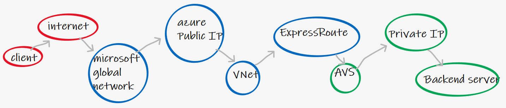
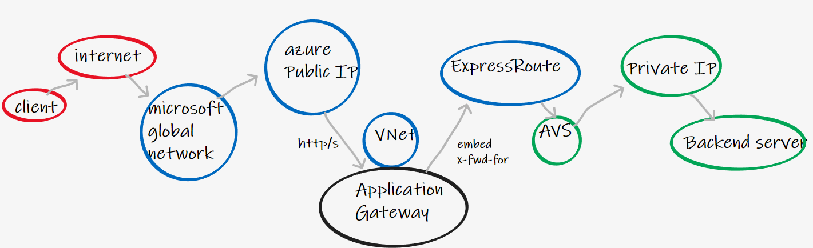
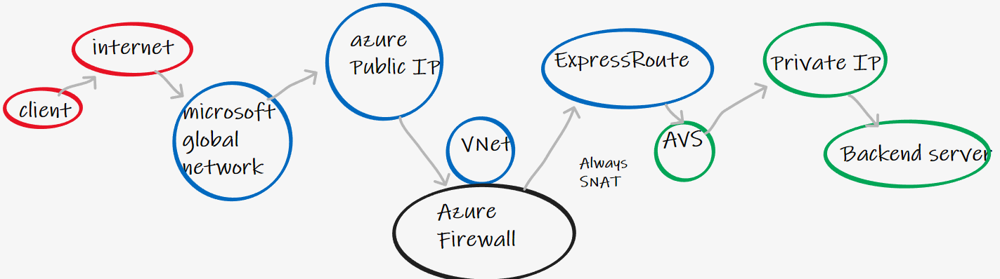
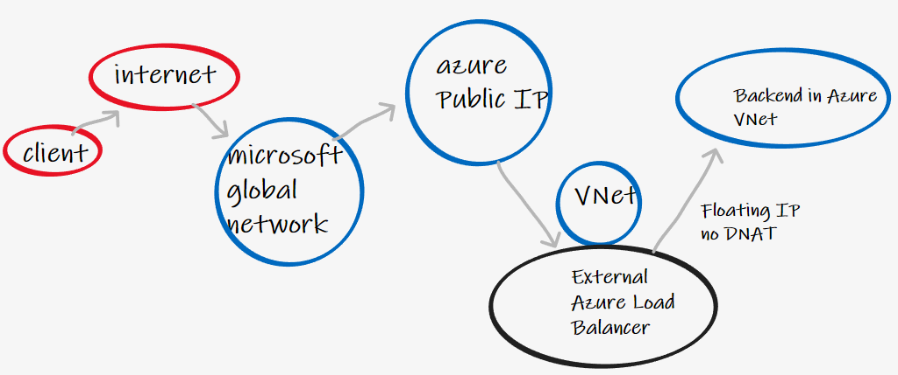
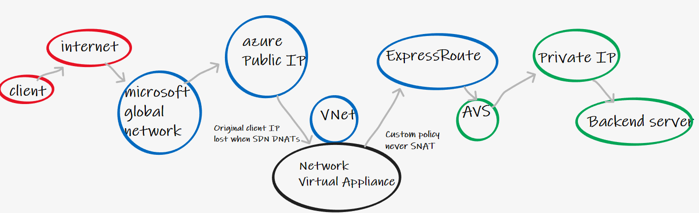
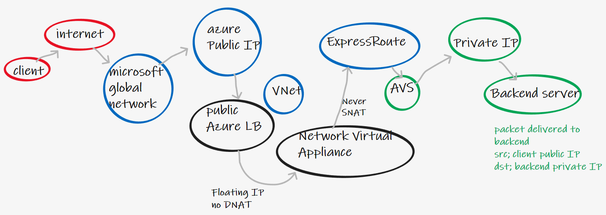
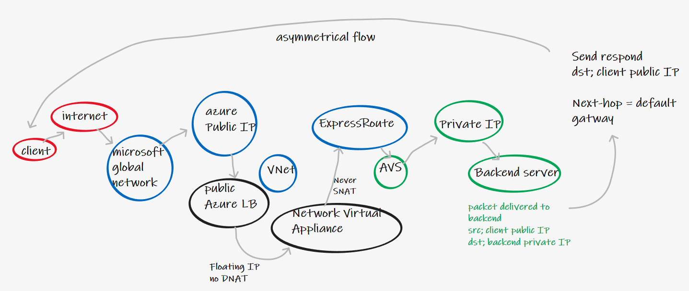
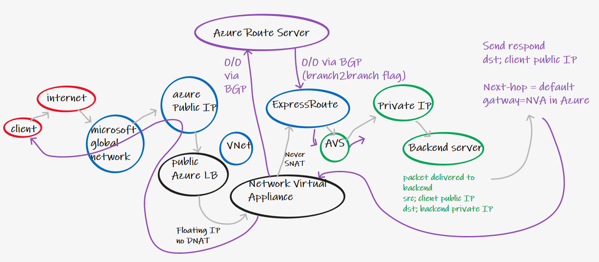

# Azure Load Balancer Floating IP to On-Premises (or AVS) backend

# Short on time?

There is no shortcut for this one! Its a pretty convoluted scenario so stick with it to understand the use-case, solution and end-to-end packet flow.

#  Introduction

## Context/Scenario

A customer had a fairly esoteric requirement therefore I wanted to take the time to document the solution before I forget the minor details. At a high level they wanted to:

- Receive traffic from endpoints on the public Internet
- Receive this traffic on a Public IP running in Azure
- The application is using a custom protocol (not http/s)
- Route the traffic to a backend internal server hosted on Azure VMware Solution (AVS)<sup>1</sup>
- Importantly, when the traffic was sent to the backend, the destination public IP needed to be retained


> <sup>1</sup> In my example the backend is within AVS, however this solution could equally be used for a backend that is situated within an On-Premises Data Centre. AVS is, today, connected to an Azure Virtual Network via an [internal ExpressRoute](https://docs.microsoft.com/en-us/azure/azure-vmware/concepts-networking), therefore the logic remains the same.

Or put more simply, in the diagram below, the client initiates traffic towards an Azure PiP, and the traffic should arrive at the backend server sourced from the clients public IP.



# Solutions that will not work

## Application Gateway

Using Application Gateway we could expose a public IP to the Internet, and even specify a backend server on AVS, however we have some problems;

- Application Gateway is http/s only
- Any use of x-forward-for http header logic won't help us as our use case is non http
- Application gateway SNAT's by default to a backend private IP of an underlying instance



## Azure Firewall

Using Azure Firewall we could expose a public IP to the Internet, and utilises its DNAT functionality to map an external PIP to internal private IP address within AVS. However we have one main problem;

- Azure Firewall always performs SNAT on the packet received from public destinations, I.e. the backend on AVS would receive the packet, but its source IP address would be a private IP address of a node in the underlying Azure Firewall pool. 



## _Only_ Azure Load Balancer

Using a public facing Azure Load Balancer we could receive traffic on a public IP from the Internet. Azure LB never performs SNAT. However we have some problems;

- Azure Load Balancer only supports backends inside of an Azure Virtual Network, not within remote networks via ExpressRoute
- This solution would work great if customer workloads was running on Azure native VNet. 



## _Only_ a Network Virtualised Appliance (NVA)

Using a simple Azure Public IP address mapped to a Virtual Machine representing a Network Virtual Appliance (E.g. Cisco CSR) we are able perform more advanced custom NAT translation logic. However we have a problem;

- Even before the NVA receives the traffic, Azure will DNAT the traffic before sending it to the NVA VM. I.e. for a simple public IP, you can think of it as always operating with Floating IP disabled. (Which makes sense, otherwise every VM operating system would need a loopback listening for traffic on a public IP, in addition to its actual private IP on the logical network adapter)



# A solution that will work<sup>1</sup> 

> <sup>1</sup>  With sufficient thrust, [pigs fly just fine](https://datatracker.ietf.org/doc/html/rfc1925). However, this is not necessarily a good idea. It is hard to be sure where they are going to land, and it could be dangerous sitting under them as they fly overhead.

# Overview

Our niche requirement needs a combination of components; 

- We need the [Floating IP](https://docs.microsoft.com/en-us/azure/load-balancer/load-balancer-floating-ip) behaviour (no DNAT) of an external Azure Load Balancer
- We also need the flexible NAT configuration available within third party NVAs that allow us to prevent SNAT after the VM forward the packet towards our AVS backend



## Packet walk

Assuming;

Client Public IP = 1.2.3.4
Azure Public IP = 20.20.20.20
NVA untrust NIC = 10.1.1.1
NVA trust NIC = 10.2.2.2
AVS backend server = 192.168.2.1


| hop | src.ip |   dst.ip | notes |
| ------------- | ------------- |   ------------- | ------------- |
| [1] Client to Azure   | 1.2.3.4  |   20.20.20.20  |  |
| [2] Azure LB to NVA untrust  | 1.2.3.4 |   20.20.20.20  | Azure LB is magic<sup>1</sup> #thereisnospoon|
| [3] NVA trust to AVS backend svr  | 1.2.3.4  |   192.168.2.1 |  |

<sup>1</sup> Short story; underlay handles service chaining transparent to overlay LB packet forwarding

<sup>1</sup> Long story; https://conferences.sigcomm.org/sigcomm/2013/papers/sigcomm/p207.pdf 

## Considerations

- You need to define Azure Load Balancer rules, today, on a per rule per port basis. (I.e. there is no [HAports](https://docs.microsoft.com/en-us/azure/load-balancer/load-balancer-ha-ports-overview) for public load balancer)
- Single NVA for simplicity, production would utilise at least two NVA, with LB on path on return

### Example NVA NAT config

This was tested on a Cisco CSR in Azure, checkout Jeremy Wright's great labs for quickstart guides. https://github.com/jwrightazure/lab

```
interface GigabitEthernet1
 description outside
 ip address dhcp
 ip nat outside
interface GigabitEthernet2
 description inside
 ip address dhcp
 ip nat inside

ip nat outside
ip nat inside
ip nat inside source static 192.168.2.1 1.2.3.4

ip route 0.0.0.0 0.0.0.0 10.0.2.1

router bgp 65019
 bgp router-id 5.6.7.8
 neighbor 10.10.0.4 remote-as 65515
 neighbor 10.10.0.4 ebgp-multihop 255
 neighbor 10.10.0.5 remote-as 65515
 neighbor 10.10.0.5 ebgp-multihop 255
 
 address-family ipv4
  neighbor 10.10.0.4 activate
  neighbor 10.10.0.5 activate
  maximum-paths 2
  default-information originate
```

Don't forget

- Enable IP forwarding on NVA interfaces
- Check NSGs (you will require non-standard outbound rules as packets are sourced from NVA from an unknown network due to no SNAT)
- Azure LB will have to health probe your NVA, I used port 80 in testing, as the CSR responds to this by default due to the presence of a HTTP server (and easily verified via `show ip http server statistics commands`)
- Azure LB health probe will come from IP 168.63.129.16, as long as your CSR has default 0/0 route pointing back out the untrust interface, these should be responded to just fine

## We have another problem to fix

In the diagram below, your diligent cloud packet herding has now got the fabled packet to the backend on AVS (or On-Premises) with its original IP intact. This makes your niche application owner happy as they can identify the client and make stuff work. 

However when your backend responds to the client, what will happen? AVS has a packet to forward with dst.ip = 1.2.3.4. It has no idea where this exists, it will forward it to its default gateway. Depending on how you've configured AVS, this either means the packet won't get back to the client at all, or it will return to the client, but with a completely different IP address



### Enter Azure Route Server

As if our foamy mess of network bubbles was not complicated enough, lets throw in another product! To stop the asymmetrical return traffic breaking our solution, we need to ensure that the backend server sends traffic back to the client, via the NVA. (This will reverse the NVA NAT logic and traffic will return from the same Azure Public IP the client originated traffic to.)

Luckily we now have a product that lets us advertise custom routes from Network Virtual Appliances to the Azure SDN, and even onwards to ExpressRoute/VPN connected locations; [Azure Route Server](https://docs.microsoft.com/en-us/azure/route-server/overview). 

Behold the :spaghetti: spaghetti monster :space_invader:;




> Please note, advertising a default route in the network is almost definitely going to break something, consider that all outbound internet traffic will start flowing through your NVA (unless you do route filtering etc)


# Closing

You will probably never need to do this, but if someone ever asks _"Do we still need network engineers in the cloud?"_ just send them this link.
  
